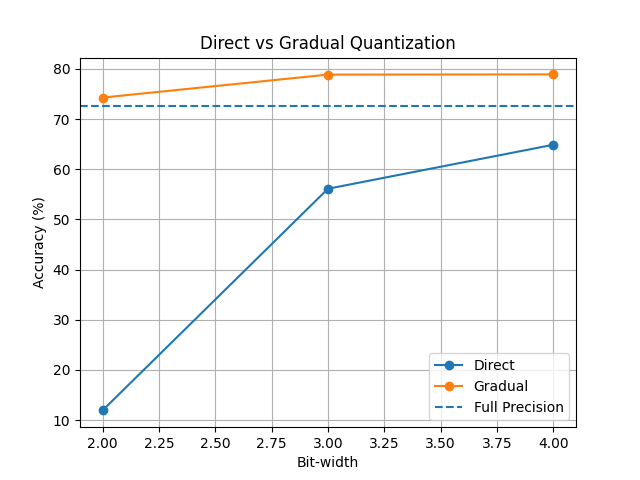
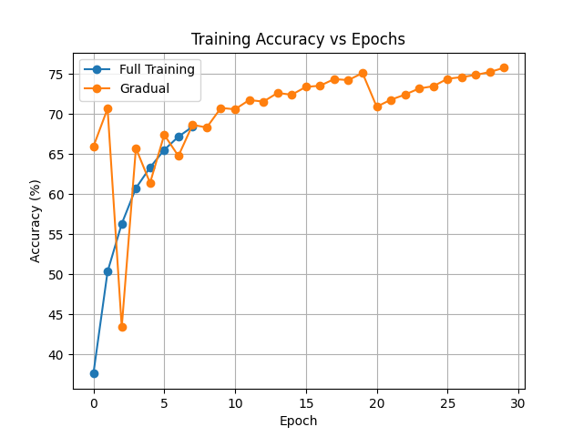
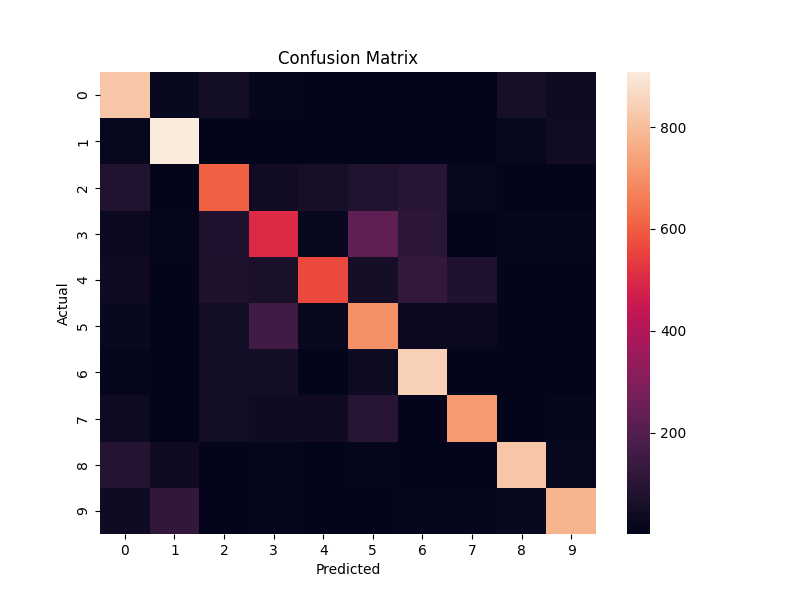

# CNN Quantization Project

## 🚀 Overview
This project compares Direct vs Gradual Quantization on CNNs trained on CIFAR-10.

## 🎯 Key Results
- Gradual quantization outperforms direct quantization
- Achieves ~79% accuracy at 3-bit precision
- Even surpasses full precision in some cases

## 📊 Results

### Bit-width vs Accuracy


### Training Curve


### Confusion Matrix


## 🧠 Key Insight
Gradual quantization improves generalization by acting as a form of regularization.

## ⚙️ How to Run
```bash
pip install -r requirements.txt
python main.py